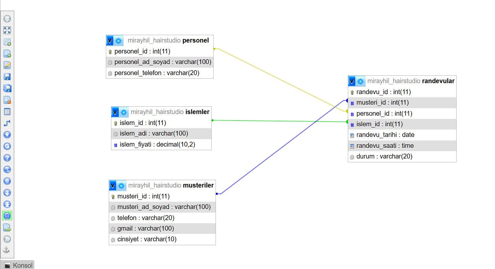

# hair-studio-db
# Salon Randevu Yönetim Sistemi — İlişkisel Veritabanı

> Bir kuaför/güzellik salonu için MySQL/MariaDB ile tasarlanmış randevu yönetim veritabanı. Müşteri, personel, işlem ve randevu kayıtlarını ilişkisel bir yapıda yönetir. ER diyagramı, SQL şeması, örnek veri, analitik sorgular ve içerir.

---

## Proje Hakkında

Bu proje, bir salonun günlük operasyonunu (müşteriler, personel, sunulan işlemler ve bunları birbirine bağlayan randevular) modelleyen ilişkisel bir veritabanıdır. phpMyAdmin üzerinde MySQL/MariaDB ile tasarlanmıştır.

Amaç, normalleştirilmiş ve referans bütünlüğü korunan bir şema kurarak; her randevunun bir müşteriye, bir personele ve bir işleme tutarlı biçimde bağlanmasını sağlamaktır.

---

## Veritabanı Yapısı

Veritabanı dört tablodan oluşur:

**`islemler`** — Salonda sunulan hizmetler
| Sütun | Tip | Açıklama |
|-------|-----|----------|
| islem_id | INT, PK, AUTO_INCREMENT | Birincil anahtar |
| islem_adi | VARCHAR(100) | İşlem adı |
| islem_fiyati | DECIMAL(10,2) | Fiyat |

**`personel`** — Çalışanlar
| Sütun | Tip | Açıklama |
|-------|-----|----------|
| personel_id | INT, PK, AUTO_INCREMENT | Birincil anahtar |
| personel_ad_soyad | VARCHAR(100) | Ad soyad |
| personel_telefon | VARCHAR(20) | Telefon |

**`musteriler`** — Müşteriler
| Sütun | Tip | Açıklama |
|-------|-----|----------|
| musteri_id | INT, PK, AUTO_INCREMENT | Birincil anahtar |
| musteri_ad_soyad | VARCHAR(100) | Ad soyad |
| telefon | VARCHAR(20) | Telefon |
| gmail | VARCHAR(100) | E-posta |
| cinsiyet | VARCHAR(10) | Cinsiyet |

**`randevular`** — Randevular (merkezdeki bağlayıcı tablo)
| Sütun | Tip | Açıklama |
|-------|-----|----------|
| randevu_id | INT, PK, AUTO_INCREMENT | Birincil anahtar |
| musteri_id | INT, FK -> musteriler | Hangi müşteri |
| personel_id | INT, FK -> personel | Hangi personel |
| islem_id | INT, FK -> islemler | Hangi işlem |
| randevu_tarihi | DATE | Randevu tarihi |
| randevu_saati | TIME | Randevu saati |
| durum | VARCHAR(20) | bekliyor / tamamlandı / iptal |

---

## İlişkiler

`randevular` tablosu sistemin merkezindedir ve diğer üç tabloyu birbirine bağlar. Her randevu **bir müşteri + bir personel + bir işlem** içerir.

- `randevular.musteri_id` -> `musteriler.musteri_id`
- `randevular.personel_id` -> `personel.personel_id`
- `randevular.islem_id` -> `islemler.islem_id`

Tüm yabancı anahtarlar `ON DELETE CASCADE ON UPDATE CASCADE` ile tanımlanmıştır; böylece referans bütünlüğü korunur.

---

## ER Diyagramı

---

## Teknik Özellikler

- **Veritabanı:** MySQL / MariaDB
- **Karakter seti:** utf8mb4 (Türkçe karakter desteği)
- Birincil ve yabancı anahtarlar, `CASCADE` ile referans bütünlüğü
- `AUTO_INCREMENT` ile otomatik kimlik üretimi
- Normalleştirilmiş tablo yapısı (tekrar eden veri yok)

---

## Dosyalar

| Dosya | Açıklama |
|-------|----------|
| `mirayhil_hairstudio.sql` | Şema + örnek veri (içe aktarılabilir tam döküm) |
| `analiz_sorgulari.sql` | Örnek analitik SQL sorguları (JOIN, GROUP BY, toplulaştırma) |
| `er_diyagrami.png` | Veritabanı ER diyagramı |

---

## Kurulum

1. phpMyAdmin'de yeni bir veritabanı oluştur.
2. **İçe aktar (Import)** -> `mirayhil_hairstudio.sql` dosyasını seç -> çalıştır.
3. Tablolar, ilişkiler ve örnek veri otomatik olarak yüklenir.

Analitik sorguları denemek için `analiz_sorgulari.sql` içindeki sorguları SQL sekmesinde çalıştırabilirsin.

---

## Yazar

**Miray Hilesiz**
Yönetim Bilişim Sistemleri, Yüksek Lisans — Haliç Üniversitesi

İletişim: [mirayhilesiz.com](https://mirayhilesiz.com) · hilesizmiray@gmail.com
